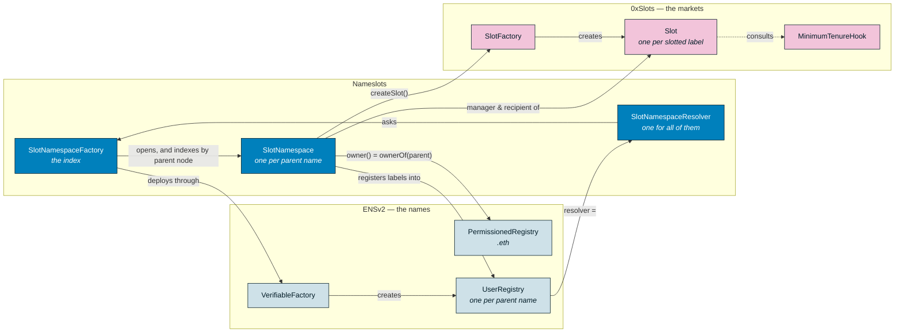
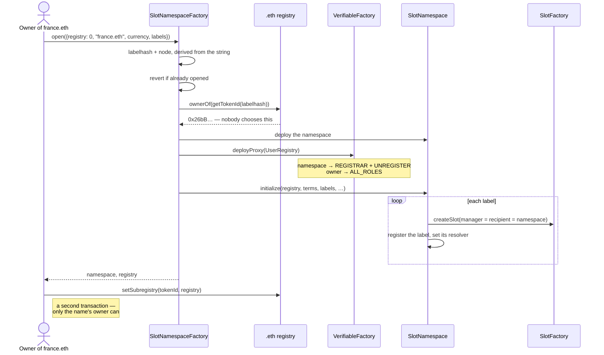
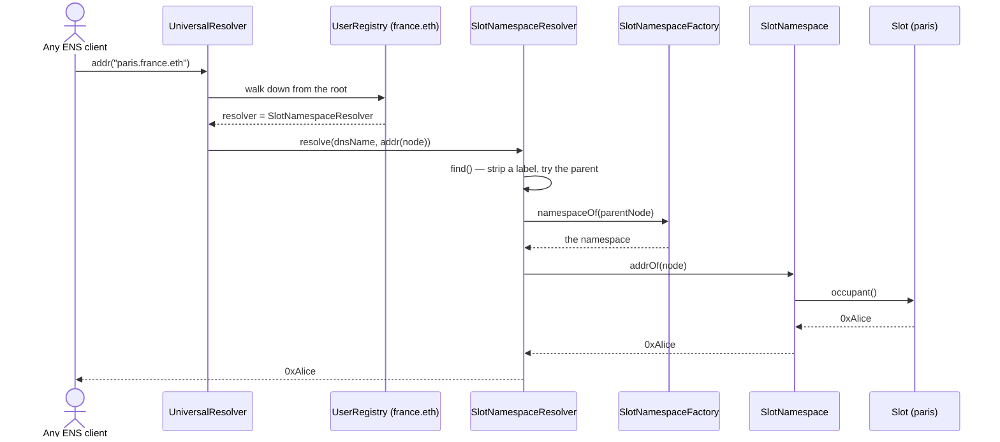
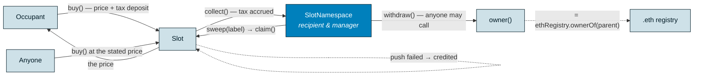
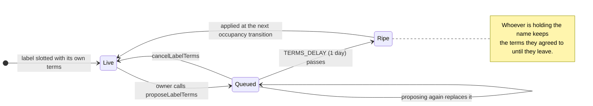

# The protocol, as deployed

What exists, how a namespace is opened, how a name resolves, where the money
goes, and how terms change. Current as of factory v2 / namespace v4 on Sepolia.

---

## What exists

Only the first group is ours. ENSv2 owns the names, 0xSlots owns the markets,
and this sits between them holding neither.

The factory is the index because nothing else can be: an ENSv2 registry does not
know its own name, and resolution only ever walks *down* from the root. So the
resolver cannot ask a name which namespace it belongs to — it asks the factory.

---

## Opening a namespace

One transaction for everything the factory can do. The second is `setSubregistry`,
which belongs to the name's owner and to nobody else — the app sends it, but the
factory could never send it on anyone's behalf.

Terms are per label. There is no namespace default to inherit: every label states
its own tax rate and its own guaranteed run, or it is not opened.

---

## How a name resolves

Ordinary ENS. No SDK, no API key, no contract address — and a turnover writes
nothing, so nothing about it can fail.

The subname stays registered to the namespace contract permanently. What follows
the holder is *resolution*, read at the moment you ask. Text records are keyed by
the slot's `tenureId`, so they clear on turnover and do not come back if the same
person retakes the name.

---

## Where the value goes

Authority and income are both derived from the ENS name, not stored. Sell
`france.eth` and both move to the buyer in the same block, with no transaction.

`withdraw()` is ungated on purpose: it pays `owner()` whoever calls it, so someone
else triggering a payment *to* the owner is a favour, not an attack. `sweep()`
exists because the slot pushes payouts with only `PAYOUT_GAS` of head-room and
credits them when that fails.

---

## Changing the terms

The owner can re-price the market they run, but never *now*.

Which is why the app's button says "Queue it", never "Set", and the panel everyone
can see says what is queued. A change nobody could see coming would be the trap.

---

## Authority, in one list

| Who | What they can do | Where it comes from |
|---|---|---|
| Holder of the parent `.eth` name | Slot and unslot labels, propose terms, edit the parent profile, receive all tax | `ethRegistry.ownerOf` — derived, never stored, non-transferable on its own |
| Occupant of a label | Set that name's price, write its records, be bought out | `slot.occupant()`, records scoped to `tenureId` |
| Anyone | Buy any occupied label at its stated price, `collect()`, `sweep()`, `withdraw()` to the owner | ungated by design |
| `admin` | Replace the code behind every namespace at once | one key today; `transferAdmin` moves it to a multisig |
